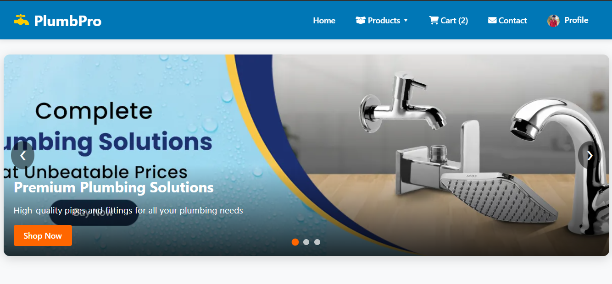
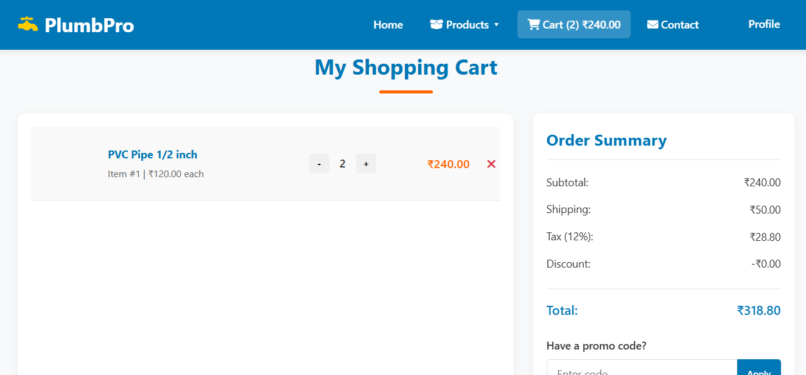
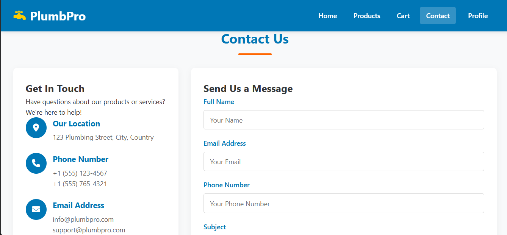
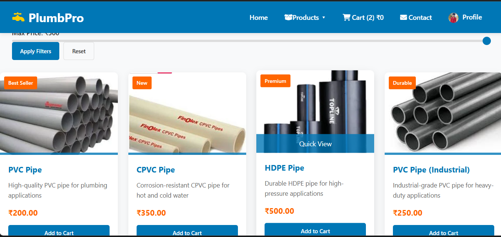
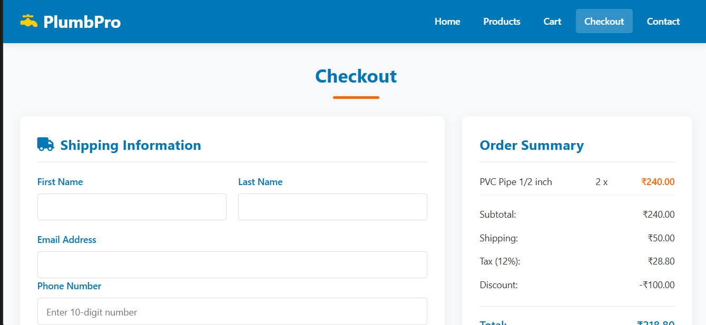
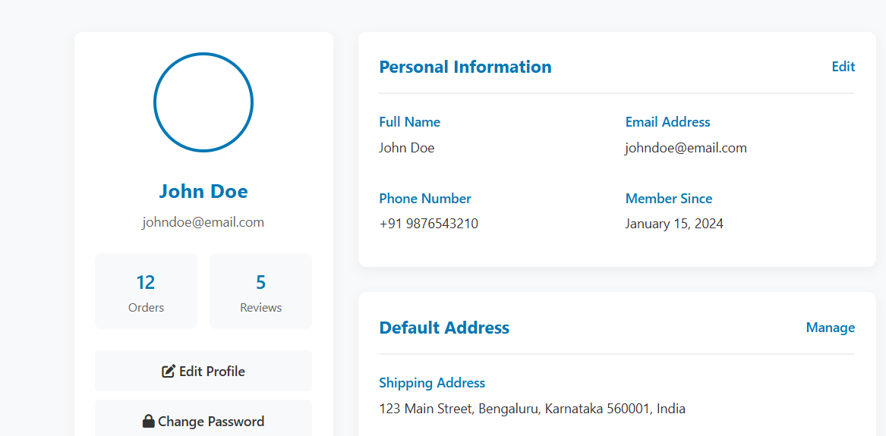

# 💧 Plumbing Service Website

A complete **Plumbing Service Website** built using **HTML**, **CSS**, and **JavaScript**.  
This project is a realistic simulation of a plumbing business platform — featuring multiple service pages, user login/signup, order management, and payment flow (front-end simulation).

---

## 🧰 Tech Stack

- **HTML5** – Structure and page layout  
- **CSS3** – Styling, responsiveness, and animations  
- **JavaScript (Vanilla JS)** – Interactivity, form validation, and dynamic content  

---

## 🌐 Features

✅ **Responsive Multi-Page Website**  
✅ **Home Page** – Overview of the plumbing services  
✅ **Product Pages** – Includes bathroom fittings, pipes, etc.  
✅ **Cart System** – Allows users to view selected items  
✅ **Login & Signup Pages** – Front-end authentication simulation  
✅ **Profile Page** – Displays basic user details  
✅ **Order & Payment Pages** – Simulated order placement and payment process  
✅ **Logout Functionality** – Clears session and redirects  
✅ **Contact Form** – For customer inquiries with validation  
✅ **JavaScript Alerts** – For validation and interaction feedback  

---
## 🧪 Testing

- All HTML pages validated successfully in browser.

- JavaScript-based form validation works as expected.

- Checked responsiveness on Chrome, Edge, and Firefox.

- All internal links between pages verified.

- Payment and order pages tested for simulated functionality.

 ---
 ## 📸 Screenshots
### Home Page

### Cart Page

### Contact Page

### Product Page

### Checkout Page

### Profile Page

---
## 👨‍💻 Author

Anil Kumar G R

💼 College Mini Project – Plumbing Service Website

📅 2025

